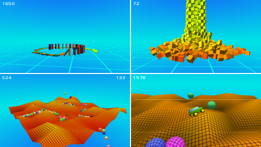

# ZgeBullet

**ZgeBullet** is a 3D physics library for the [ZGameEditor](http://www.zgameeditor.org) (ZGE).
It is created as a wrapper for the [Bullet Physics Library](http://bulletphysics.org),
an open-source collision detection and rigid body dynamics library. The main purpose is
to adapt the original C++ interface to the type system of ZGE. ZgeBullet can either be compiled
as a Windows DLL or an Android shared library. Physics-aware ZGE projects refer to the ZgeBullet
as an external library.

ZgeBullet is free for commercial use and open source under the [Zlib License](http://opensource.org/licenses/Zlib).

Links:
* Download compiled versions of the library and demo projects from [here](https://github.com/Rado-1/ZgeBullet/releases).
* For more information about how to build ZgeBullet Library see this [page](../../wiki/How-to-Build).
* Latest changes are listed in [version history](../../wiki/Version-History).
* Related [forum discussion](http://www.emix8.org/forum/viewtopic.php?t=830).
* It is recommended to use the latest beta release of ZGameEditor downloaded from [here](http://www.zgameeditor.org/files/ZGameEditor_beta.zip).
* [Demo video](http://www.youtube.com/watch?feature=player_embedded&v=50SliYSy6KY) (YouTube).

